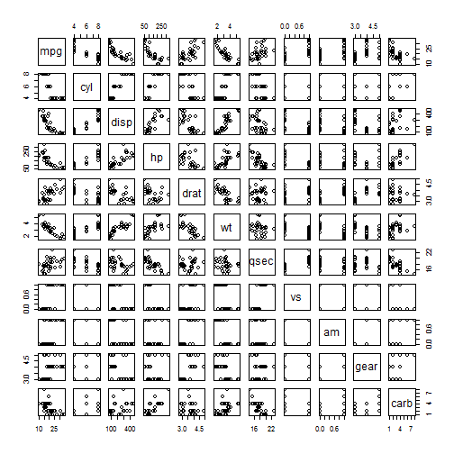

Developing Data Products - mtcars
========================================================
author: Martyn Yap
date: 26th Apr 2015

Presentation Objective
========================================================

The objective is to present the Shiny application was developed for the course project.

Design
========================================================

It uses the mtcars dataset. It contains plot settings for interactive data analysis without code modifications.

The application can be accessed at the following URL:
http://martynyap.shinyapps.io/ddp-mtcars

On the mtcar dataset:
It was from the 1974 Motor Trend US magazine, and comprises fuel consumption and 10 aspects of automobile design and performance for 32 automobiles (1973-74 models).

Plotting
========================================================

To plot in R, just simply run
 

Summary
========================================================

Shiny is a powerful tool for creation of web-based applications.
